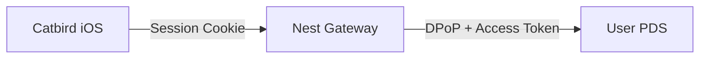

# Nest Architecture: The Catbird Gateway

**Nest** is a Rust-based "Backend for Frontend" (BFF) gateway for the Catbird iOS application. It acts as a **Confidential OAuth Client** option for Petrel.

## 1. Role in the Ecosystem

Nest is an *optional* infrastructure component. Petrel (the iOS library) can operate in three modes:
1.  **Legacy:** Direct Password Auth (Direct to PDS).
2.  **Public:** Direct OAuth (Direct to PDS).
3.  **Confidential (Nest):** Proxied OAuth (via Nest).

This document details the architecture of the **Confidential** path.

## 2. Core Objectives

1.  **Confidential Authentication:**
    *   Nest acts as the OAuth Client.
    *   It manages the **ATProto Refresh Token** securely on the server side (Redis).
    *   It handles **DPoP** signatures for upstream requests.
    *   The iOS client receives a **Session Artifact** (Cookie or Reference Token).

2.  **Session Stability:**
    *   Solves "flaky logout" issues.
    *   Nest manages the precise lifecycle of the ATProto session.

3.  **Content Enrichment:**
    *   Nest inspects JSON responses from the PDS.
    *   It handles "nuclear blocks" or other complex states by injecting metadata into the JSON stream before it reaches the iOS app.

## 3. Technology Stack

*   **Language:** Rust (Axum, Tokio).
*   **AT Protocol:** Atrium (`atrium-oauth`, `atrium-api`).
*   **Storage:** Redis (Session Store).

## 4. Architecture Components

### A. The "Smart" Gateway

**Request Flow:**

1.  **Incoming:** `GET /xrpc/app.bsky.feed.getPostThread` (with Session Cookie).
2.  **Nest Auth:** Validates Cookie against Redis.
3.  **Nest Upstream:**
    *   Retrieves ATProto Access Token from Redis.
    *   Refreshes if necessary (using backend DPoP key).
    *   Forwards request to PDS with correct ATProto headers.
4.  **Nest Enrichment:**
    *   Intercepts PDS response.
    *   Injects custom fields (e.g., `catbirdContext`).
5.  **Response:** Returns modified JSON to iOS.

### B. Authentication Flow

1.  **Login:**
    *   iOS requests Login URL from Nest.
    *   Nest generates PAR, returns PDS Authorization URL.
    *   User authenticates at PDS.
2.  **Callback:**
    *   PDS redirects to Nest.
    *   Nest performs Token Exchange (Private Key JWT).
    *   Nest creates Session (Redis).
    *   Nest redirects to iOS (`catbird://...`) with Session Cookie/Token.

## 5. Security

*   **Client vs Gateway:** The iOS client is "dumb". It does not hold the Refresh Token. It holds a session identifier for the Gateway.
*   **DPoP:** Handled entirely by Nest.