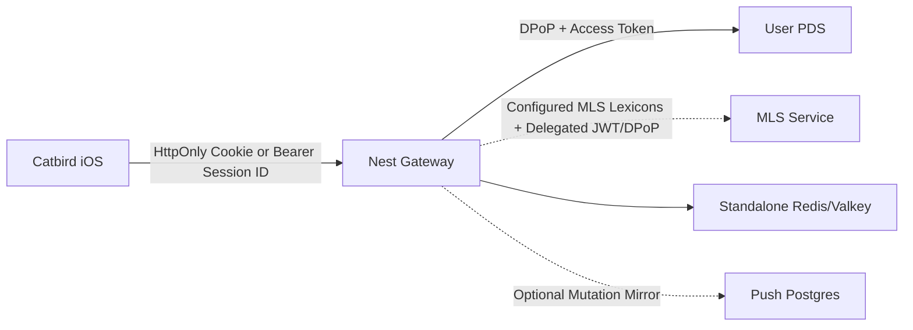

# Nest Architecture: The Catbird Gateway

**Nest** is a Rust-based "Backend for Frontend" (BFF) gateway for the Catbird iOS application. It acts as a **Confidential OAuth Client** option for Petrel.

## 1. Role in the Ecosystem

Nest is an *optional* infrastructure component. Petrel (the iOS library) can operate in three modes:
1.  **Legacy:** Direct Password Auth (Direct to PDS).
2.  **Public:** Direct OAuth (Direct to PDS).
3.  **Confidential (Nest):** Proxied OAuth (via Nest).

This document details the architecture of the **Confidential** path.

## 2. Core Objectives

1.  **Confidential Authentication:**
    *   Nest acts as the OAuth Client.
    *   It manages the **ATProto Refresh Token** securely on the server side (Redis).
    *   It handles **DPoP** signatures for upstream requests.
    *   The client receives an opaque **Nest Session ID**, carried in an HttpOnly cookie or as a Bearer token.

2.  **Session Stability:**
    *   Solves "flaky logout" issues.
    *   Nest manages the precise lifecycle of the ATProto session.

3.  **Bounded Proxying and Mutation Mirroring:**
    *   Nest returns PDS response bodies unchanged through bounded buffering or streaming.
    *   Selected successful moderation mutations may also be mirrored into the optional Postgres-backed push state; this side effect does not rewrite the response JSON.

## 3. Technology Stack

*   **Language:** Rust (Axum, Tokio).
*   **AT Protocol:** Jacquard (`jacquard-oauth`, `jacquard-common`, `jacquard-identity`).
*   **Storage:** standalone Redis/Valkey for encrypted OAuth/session state; optional Postgres for push state.

## 4. Architecture Components

### A. The "Smart" Gateway

```mermaid
graph LR
    iOS[Catbird iOS] -- HttpOnly Cookie or Bearer Session ID --> Nest[Nest Gateway]
    Nest -- DPoP + Access Token --> PDS[User PDS]
    Nest -. Configured MLS Lexicons + Delegated JWT/DPoP .-> MLS[MLS Service]
    Nest --> Redis[Standalone Redis/Valkey]
    Nest -. Optional Mutation Mirror .-> Postgres[Push Postgres]
```

**Request Flow:**

1.  **Incoming:** `GET /xrpc/app.bsky.feed.getPostThread` with an HttpOnly session cookie or Bearer session ID.
2.  **Nest Auth:** Validates the opaque session identifier against Redis.
3.  **Nest Upstream:**
    *   Retrieves ATProto Access Token from Redis.
    *   Refreshes if necessary (using backend DPoP key).
    *   Forwards request to PDS with correct ATProto headers.
4.  **Nest Response Handling:**
    *   Enforces bounded buffering/streaming for the upstream body.
    *   Mirrors selected successful moderation mutations into push state when that subsystem is enabled.
5.  **Response:** Returns the upstream response body unchanged.

### B. Authentication Flow

1.  **Login:**
    *   iOS requests Login URL from Nest.
    *   Nest generates PAR, returns PDS Authorization URL.
    *   User authenticates at PDS.
2.  **Callback:**
    *   PDS redirects to Nest.
    *   Nest performs the provider token exchange using confidential-client authentication.
    *   Nest creates the encrypted Redis-backed OAuth session.
    *   Nest redirects to the approved client target with a short-lived, one-time exchange code rather than the session credential.
3.  **Browser Session Exchange:**
    *   The client sends the exchange code, original browser nonce, and exact browser Origin to `POST /auth/exchange`.
    *   Nest atomically redeems the origin/nonce-bound code, sets an HttpOnly cookie, and returns the opaque session ID.
4.  **Authenticated Requests:**
    *   Protected routes accept either the HttpOnly cookie or `Authorization: Bearer <session-id>`.

### C. Conditional MLS Routing

When `mls.service_url` and `mls.gateway_did` are configured, Nest routes `blue.catbird.mlsChat.*` lexicons directly to the configured MLS service. Nest requires an authoritative local session/device binding and creates a short-lived, lexicon-scoped service JWT plus DPoP proof using the configured gateway DID, service DID, and proof origin. The MLS service remains responsible for validating the delegated JWT and DPoP proof and enforcing audience, lexicon, device, replay, and authorization policy. Without this configuration, MLS lexicons follow the normal PDS proxy path.

## 5. Security

*   **Client vs Gateway:** Clients do not hold ATProto refresh tokens. They hold only an opaque Nest session identifier.
*   **Session Protection:** An OAuth-capable deployment requires two independently generated 32-byte session-encryption and identifier-HMAC secrets, base64-encoded in the environment and supplied outside source control.
*   **DPoP:** Nest generates DPoP proofs for upstream PDS requests.
*   **CORS:** The browser allowlist contains exact canonical HTTP(S) origins. An empty allowlist denies cross-origin browser access.
*   **Trusted Proxies:** Forwarding headers affect rate-limit identity only when the socket peer is explicitly configured as trusted.
*   **Rate Limiting:** Redis provides fleet-shared counters, with a bounded local fallback. The limiter covers login, browser exchange, and authenticated XRPC routes; it is not global middleware for every endpoint.
*   **MLS Boundary:** Nest performs local binding and credential construction; downstream credential validation and authorization remain external to Nest.
